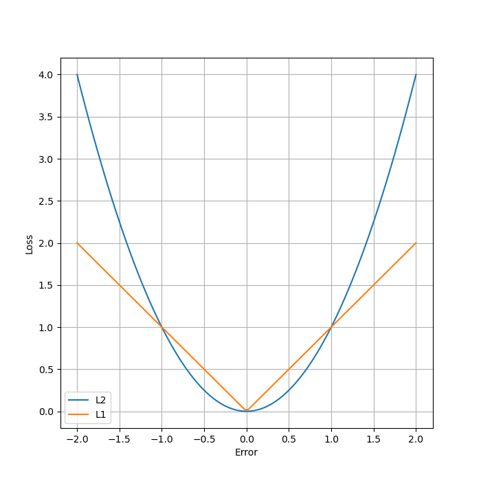
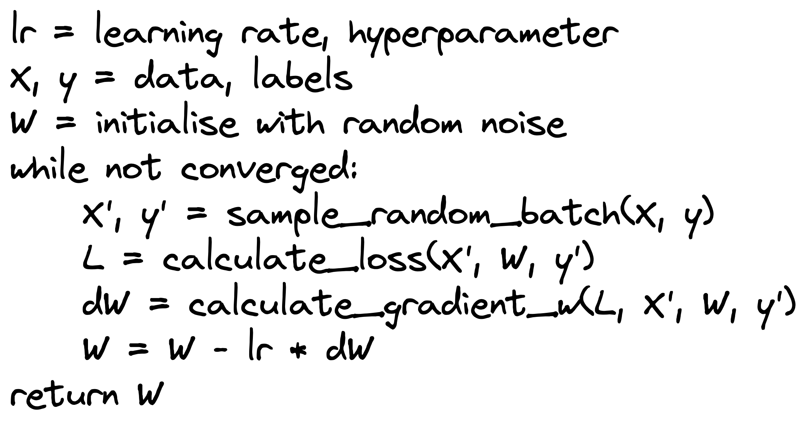

# DL. Intro. Blazingly fast

---

by @podidiving

#### Table on content
- Some core concepts
	- ML models
	- Objective function
	- Optimization
	- Data
	- Metrics
- DL intro
	- NN models
	- Optimization

---

Hey y'all! 👋

Today we gonna meet with the machine learning and deep learning fields.  What is it? Why does it work? How can I build an AI, that will replace me? We'll try to answer that questions (at least, some of them)

By the end of this text you won't become an expert, but you'll have a basic understanding of how some of the algorithms of ml and dl work. At least, I do hope so.

This post is definitely not a self-sufficient product. It's just a quick dive. A person who is eager to gain a deep understanding of AI will likely be left disappointed. But hold on! At the end, you can find lots of super useful links to continue your journey! (Actually, I believe that is my biggest contribution here)

And before we start, there's a little bit of incentive. You may wonder: "Why do I even want to learn anything Deep Learning related?" Well, I don't have an answer, but I have a photos of an average DL researcher:

(Well, of course it's AI generated, real DL engineers are much more better-looking)

Okay, now let's get started. 🏎️

---
# Machine Learning intro

Before we go into some formal definitions (yeah, there's gonna be some maths involved), we should answer the question "What is Machine learning?". Well, here it is:

> Machine learning is a subfield of artificial intelligence (AI) that involves creating algorithms and models that allow computers to learn from data and improve their performance at a task over time. In traditional programming, a programmer writes code that specifies how a computer should perform a certain task. With machine learning, the computer can learn how to perform a task on its own by analyzing data and finding patterns.

> There are several different types of machine learning, including supervised learning, unsupervised learning, and reinforcement learning. In supervised learning, the computer is given a set of labeled examples (inputs and corresponding outputs) and learns to map inputs to outputs. In unsupervised learning, the computer is given data without labels and learns to find patterns and structure in the data. In reinforcement learning, the computer learns through trial and error, receiving feedback in the form of rewards or punishments based on its actions.

> Machine learning has many practical applications, such as image and speech recognition, natural language processing, predictive analytics, and recommendation systems.

Everything is clear, right? The cool thing is I didn't write this definition. In fact, no human being did. This was produced by [ChatGPT](https://chat.openai.com) [LLM](https://en.wikipedia.org/wiki/Large_language_model). All I had to do was simply ask it "What is Machine learning?". Kinda crazy 🤯

So, there was something about different types of machine learning. All of them are extremely interesting, but it's a story for another time. Today we'll focus on supervised learning only. What does a model look like? How does it "learn"? What does a set of labeled examples mean? How do we know, that this thing even works? Let's answer all this. Step by step. With some maths involved, of course.

*NOTE!!!* The following text doesn't generalize all machine learning and deep learning models and algorithms. The text written here is correct only for a certain class of models, not for all.

## ML Models
---

(almost) Everything in this world can be seen as data points. And these data points come from different data distributions. Usually we don't know what the real distribution is, but we'd like to approximate it somehow.

For example
- You have a company, which has customers. Every customer is a data point, sampled from a distribution of all people, who could be your customers. You'd really like to know what does this distribution look like (so, you can tell about yourself to all other people, who are not yet your customers)
- You really like some images of puppies. These images are samples from a distribution of all images you'd like if you saw them. So you can be interested what the real distribution is, so you could look at all those beautiful little puppy faces. 🐶

The motivation is clear. We want to approximate real-world distributions. That's what ML models are for. 

### Definition

Formally, ML model is a mathematical function:
$$f: \mathcal{X} \rightarrow \mathcal{Y}$$
Where $\mathcal{X}$ is a set of all data points and $\mathcal{Y}$ is a set of labels, associated with that data points. (remember, we are only talking about supervised learning)

For example:
	- $\mathcal{X}$ is a set of all puppy images. $\mathcal{Y}$ is a set of associated scores showing how much you'd like this image. Since you haven't seen all the images, you know only about a few pairs $(x, y)$ - an image of a puppy and a score showing how much you liked it. So the task of the model is to approximate this mapping, so the next time a system shows you an image, you like it

### Parameters

This is a parameterizable function. We'll it see later in greater details, but for now, let's just say, there is two types of parameters:
- **Trainable parameters** - parameters that are learned during training on your data. They accumulate information from the data
- **Hyperparameters** - some architectural and other stuff you decide before the training begins

**Example**:
1. In case of a *linear* model (i.e. model $f_w(x) = w^Tx$) $w$ is a trainable parameter. Hyperparameters will be such things as: regularization, learning rate, and optimizer (some stuff we haven't discussed yet)
2. Let's imagine, you have a bunch of points from some distribution. You want to build a model, which generates points from the same distribution. What will be your hyperparameters and trainable parameters?

---

## Objective function

We have a parameterizable function. Question, that should be asked:
- How do we understand whether it works good or not?
- How do we train it's parameters, so it works even better?

The answer is a loss function. Let's see what it is.

### Definition

>An objective function, also known as a loss function or cost function, is a mathematical function used in machine learning to evaluate how well a machine learning model is performing on a given task. The objective function measures the difference between the model's predicted output and the actual output, also known as the ground truth.

So, we have data $\{x_i, y_i\}_i^N, x\in\mathcal{X},y\in\mathcal{Y}$ , ml model $f$, and also a loss function $L$:
$$
L: (a, b) \rightarrow (0, +\infty), \ \ a, b \in\mathcal{Y}
$$
Formally, this function takes any $a,b\in\mathcal{Y}$, but we use it the following way: $L(f(x_i), y_i)$

$L$ should have some nice properties, such as:
- When $L(a,b) \rightarrow 0$ this means that $a$ and $b$ are pretty much the same, so we did a good job. On the other hand, when $L(a, b) \rightarrow+\infty$ something went wrong and our model doesn't working the way it should
- We often want this function to be differentiable (we'll see in a bit why)

Here's the main idea behind all this. The model is parameterized by some parameter $\theta$, so the model is actually $f_\theta$. The resulting loss is also a function of the parameter $\theta$: $loss = L(f(x), y) = L(f_\theta(x), y) = L_\theta$ (since $x$ and $y$ are fixed). So, by tweaking $\theta$ we can change the final $loss$, and if we do everything correct, we'll get a much lower loss, which corresponds to a better function! It remains only to figure out how to do it.

**Example**:
Imagine, you'd like to build a model, which predicts fair salary based on person's resume. Somehow, you have a dataset ($x_i$ is a resume, $y_i$ is salary). Your model should predict salary. When your target and your prediction are any numbers from a line number (well, technically salary can't be negative, but we'll omit this fact) it's the case for *regression* model. The two most popular choices for a loss function in that case:
- $L_1$ loss: $L_1(a, b) = \|a - b\|$
- $L_2$ loss: $L_2(a, b) = \|a - b\|_2^2$
They look like this:

### Logistic Regression

Now, let's talk about classification. And especially binary case. Essentially, classification is the task in which $\mathcal{Y}$ is a limited set. In case of binary classification, it's just a set, which consists of 2 points: $\{0, 1\}$:
$$
X, y = \{x_i,y_i\}_i^N, \forall i\ \  y_i\in\{0,1\}
$$

*NOTE:* thing to know about ml models is that they don't sit well with the predictions from a limited set. They would rather prefer to predict a number from $\mathcal{R}$ (this is because of their architecture, we haven't discussed yet, so you just have to believe me)

Now, we have some probability distribution, we'd like to predict
$$
p(y_i\vert x_i) \in (0,1),\ \ \ y_i\in\mathcal{Y},x_i\in\mathcal{X}
$$
Define $p_+$ as a probability of $y$ being equal $1$:
$$
p_+ := p(y = 1 \vert x)
$$
Define a new variable. Note, it's bounds now are $(0, +\infty)$:
$$
OR_+ := \frac{p_+}{1 - p_+} \in(0, +\infty)
$$
Now take a logarithm:
$$
log\ (OR_+) \in (-\infty,+\infty)
$$
We have a variable, that can be any number. We can approximate such stuff with a *linear* function (we don't know how,  but we know we can. That's enough, right?)
$$
log\ (OR_+) \approx f_w(x) = w^Tx
$$
Now, we go the other way. First, we exponentiate it
$$
OR_+ = e^{f_w(x)}
$$
Then we put it into $p_+$ (check for yourself, that the first equation is true)
$$
p_+ = \frac{OR_+}{1 + OR_+} = \frac{e^{f_w(x)}}{1 + e^{f_w(x)}} = \frac{1}{1 + e^{-f_w(x)}} = \frac{1}{1 + e^{-w^Tx}}
$$
This function we've got usually defined as:
$$
\sigma(x) := \frac{1}{1 + e^{-x}}
$$
And is called *sigmoid function*. It looks like this:

We defined positive probability; for negative it'll be:
$$
p(y = 0\vert x) = 1 - p(y = 1\vert x) = 1 - \sigma(w^Tx)
$$
Okay, now we know, how to model probabilities. It's time to take a likelihood function of our data (if you don't remember, what likelihood is, check [here](https://en.wikipedia.org/wiki/Likelihood_function))
$$
Likelihood = \prod_{i=1}^N{p(y=y_i\vert x_i)}
$$
(Btw, haven't I told you, that our data point are independent? My bad. Well, maybe they aren't, but we need to assume that in order out maths to work)

Working with a product is a tedious task, so people usually take logarithm in order to work with a sum: 
$$
log(Likelihood) = \log(\prod_{i=1}^N{p(y=y_i\vert x_i)}) = \sum_{i=1}^N{log(p(y=y_i\vert x_i))}
$$
Now if we put our "probabilities", we get
$$
\sum_{i=1}^N{log(p(y=y_i\vert x_i))} = \sum_{i=1}^N{y_ilog(\sigma(w^Tx_i)) + (1 - y_i)(1 - log(\sigma(w^Tx_i)))}
$$
According to Maximum Likelihood Estimation (you can [refresh your memory](https://en.wikipedia.org/wiki/Maximum_likelihood_estimation) if you want) the parameter $w^{*}$ which satisfies:
$$
w^{*} = argmax_w{log(Likelihood)}
$$
is the best parameter. To convert it to loss function notation, just put $-$ sign and get:
$$
w^{*} = argmin_w{-log(Likelihood)}
$$
Now, $L=-log(Likelihood)$ is our loss function. It is also called **Cross-entropy** function. Yay! 🤩

---
#### Quick recap:
- In case of regression use $L_1$ or $L_2$
- In case of classification use Cross-entropy (We've discussed only binary classification, but it generalize for a scenario when there're more than 2 classes)
---

## Optimization

The  process of learning model's parameters is called *optimization*. We optimize our parameters so the results produced by the model are close to what we want them to be.

The most popular set of optimization techniques is based on [Gradient Descent algorithm](https://en.wikipedia.org/wiki/Gradient_descent) and it's modification [Stochastic gradient descent](https://en.wikipedia.org/wiki/Stochastic_gradient_descent)

Let's quickly remember, how this works. 

As an example, consider that a model has only two parameters. In that case we can easily draw the [countor line](https://en.wikipedia.org/wiki/Contour_line)

The best case scenario is when our model is in the center (global minima). When we are somewhere else we need to go there.

- orange dot - our current location
- orange arrow - a direction we should take in order to minimize loss (and impove our model)

There is a fact, that function's gradient is the direction of steepest ascent (check it [here](https://math.stackexchange.com/questions/223252/why-is-gradient-the-direction-of-steepest-ascent)), so anti-gradient is the direction of steepest descent. That's it. Our orange arrow is the anti-gradient. The only thing is it shows us only the direction where we should go, but it doesn't answer the question how long we should go. Okay, not a problem, we just solve it in iterative fashion. Cut to the chase, here is a pseudoalgorithm of gradient descent:

One drawback is that you need to calculate the gradient over all of your data. What if you have tons of it? It won't fit into your memory, that's for sure. Workaround is to use stochastic version of this algorithm. Let's see the algorithm and visualization of it's work

Although the direction is not as straight as it were, it works quite well. And it's fast. So, usually people go with SGD as their weapon of choise.

---
### Logistic Regression

Let's get back to our logistic regression model. Now we know the algorithm to train it. Let's dive in some maths and solve this problem once and for all!

Loss function looks like this:
$$
L = -\frac{1}{N}{\sum_{i=1}^N{y_ilog(\sigma(w^Tx_i)) + (1 - y_i)(1 - log(\sigma(w^Tx_i)))}}
$$
We should find it's gradient:
$$
\nabla_wL = -\frac{1}{N}{\sum_{i=1}^N{\nabla_w\Big[y_ilog(\sigma(w^Tx_i)) + (1 - y_i)(1 - log(\sigma(w^Tx_i)))\Big]}}
$$
(A small reminder back from the school)
$$
\nabla log(f) = \frac{1}{f}\nabla f 
$$
Now we have:
$$
\nabla_wL = -\frac{1}{N}{\sum_{i=1}^N{\Big[y_i\frac{1}{\sigma(w^Tx_i)}\nabla_w\sigma(w^Tx_i) + (1 - y_i)\frac{1}{1 - \sigma(w^Tx_i)}\nabla_w(1 - \sigma(w^Tx_i))\Big]}}
$$
The derivative of the sigmoid function (check it for yourself):
$$
\sigma'(x) = \sigma(x)(1 - \sigma(x))
$$
Put it in equation
$$
\begin{aligned}
\nabla_wL =\\ 
&-\frac{1}{N}\Big[\sum_{i=1}^N{y_i\frac{1}{\sigma(w^Tx_i)}\sigma(w^Tx_i)(1 - \sigma(w^Tx_i))\nabla_w(w^Tx_i)} \\
+ &\sum_{i=1}^N{(1 - y_i)\frac{1}{1 - \sigma(w^Tx_i)}(-\sigma(w^Tx_i))(1 - \sigma(w^Tx_i))\nabla_w(w^Tx_i)}\Big]
\end{aligned}
$$
And simplify it
$$
\begin{aligned}
\nabla_wL =\\ 
&-\frac{1}{N}\Big[\sum_{i=1}^N{y_i(1 - \sigma(w^Tx_i))\nabla_w(w^Tx_i)} \\
+ &\sum_{i=1}^N{(1 - y_i)(-\sigma(w^Tx_i))\nabla_w(w^Tx_i)}\Big]
\end{aligned}
$$
$$
\nabla_wL = -\frac{1}{N}\sum_{i=1}^N{(y_i - \sigma(w^Tx_i))\nabla_w(w^Tx_i)}
$$
A derivative of a scalar product
$$
\nabla_w(w^Tx) = x
$$
The final derivative:
$$
\nabla_wL = -\frac{1}{N}\sum_{i=1}^N{(y_i - \sigma(w^Tx_i))x_i}
$$
In the vector form (this is the one we going to work with)
$$
\nabla_wL = \frac{1}{N}X^T(\sigma(w^Tx_i) - y_i)
$$
Now, all we have to do is to place it in the SGD algorithm. 

Voila! Now you know how to train your own classifier 🔥

---

## Data

One thing we have to talk about is Data. Yeah, I know, we've already talked about it, but there're some important concepts you should be familiar with.

In machine learning, it is common to divide a dataset into three subsets: *the training set, the validation set, and the test set*.

- **The training set** is used to train the machine learning model. The model is iteratively optimized using this data, with the goal of minimizing the error between its predicted output and the true output.

So, $(x, y)$ pairs, we put into SGD algorithm are *training set*

- **The validation set** is used to evaluate the performance of the model during training. After each training iteration, the model is evaluated on the validation set to determine its current level of performance. 
	- This is used to monitor the model's ability to generalize to new, unseen data, and to detect overfitting. *Overfitting* occurs when the model performs well on the training data, but poorly on the validation data, indicating that it has memorized the training data rather than learning general patterns.
	- Also you can use validation set to tune your *hyperparameters*. As an example it can be learning rate

- The test set is used to evaluate the final performance of the model after it has been fully trained and validated. The test set is typically held out from the training and validation sets, so that the model has never seen this data before. The performance of the model on the test set provides an estimate of its ability to generalize to new, unseen data.

So, the important concept that needs to be understood: Never ever use the whole dataset as a training one (well, of course this is the rule, and it means to be broken; but in most cases don't do that). And beware of overfitting! 👻

---

## Metrics

You have trained a model, now what? It's time to quantify the performance. But we have already done it, using our loss function, right? Well, yes and no. Yes we ensured that model works correctly cause it has a low loss on the validation data. But we can't really interpt those numbers, since they don't tell us anything. 

Let's talk about classification task. Usually it comes in handy to visualize confusion matrix:

Now, which metrics should we use? There're some popular metrics you should consider:
1. **Accuracy**: The proportion of correctly classified instances out of the total number of instances.
2. **Precision**: The proportion of true positives (correctly classified positive instances) out of the total number of instances predicted as positive.
3. **Recall** (also known as sensitivity or true positive rate): The proportion of true positives out of the total number of actual positive instances.
4. **F1 score**: The harmonic mean of precision and recall, which balances both metrics.
5. **Area Under the ROC Curve** (AUC-ROC): A measure of the ability of the model to distinguish between positive and negative instances, computed by plotting the true positive rate against the false positive rate.
6. **Area Under the Precision-Recall Curve** (AUC-PR): A measure of the trade-off between precision and recall, computed by plotting precision against recall.

The choice of metric depends on the specific application and the relative importance of false positives, false negatives, and correct classifications. For example, in medical diagnosis, false negatives may be more critical than false positives, whereas in spam detection, false positives may be more critical than false negatives. 🧪

---
# Deep Learning intro

Deep Learning is a subset of machine learning (or maybe not, it depends on how you define them) which is all about big (deep) models. Right now we are going to look into the simplest class of DL models - Feed Forward Neural Nets. The idea is to get the gist of how models are constructed and how do you train them.

*Note* It's only about supervised learning. Actually, deep learning field is huge and amazing. Also, it not true, that DL is only about model architectures. But right now, we'll focus solely on them.

## Feed-Forward Networks

A feed-forward neural network (FFNN), also known as a multilayer perceptron (MLP), is a type of artificial neural network that consists of multiple layers of interconnected neurons. The network is called "feed-forward" because the information flows in a forward direction, from the input layer through the hidden layers to the output layer.

The input layer of the network receives the input data, which is then processed through a series of hidden layers. Each hidden layer is made up of multiple neurons that apply a set of weights to the input data, and then pass the result through an activation function. The output of one layer becomes the input of the next layer, until the final layer produces the output of the network.

Two main blocks of any MLP are Linear Layer and Non-Linearity. Let's dismantle them. 👷‍♀️

### Linear Layer

We,ve seen linear models, which looks like $f_{w,b}(x) = w^Tx + b$ - actually it's also a linear layer, just a small one. Now we can generalize it

Formally, $L_{W,b}(X) = XW+b$
- $X$ has the shape $(N,M)$; $N$ - number of data examples (it can be > 1 for batching), $M$ - input shape
- $W$ has the shape $(M,H)$; $M$ - input shape, $H$ - output shape
- $b$ has the shape $(H,1)$; $H$ - output shape

### Non-Linearity

Linear layers are not enough, because if you chain linear layers together, you will get another linear layer! It's important to come up with something else. Essentially, anything that is not a linear function. Hence, the term non-linearity.

Actually, there's also some proofs, that such models (linear + non-linear chain) can approximate any data (see [Universal approximation theorem](https://en.wikipedia.org/wiki/Universal_approximation_theorem))

Check out some of the most popular functions (well, maybe they are quite outdated and not so popular, but they are didefinetily the most basics ones)

##### Sigmoid function
This is the same function used in Logistic Regression. Once again, it's plot:

>Advantages:
>1. Sigmoid function is easy to understand and implement.
>2. It has a smooth and continuous derivative, which makes it suitable for optimization algorithms that use gradient descent.
>3. It is bounded between 0 and 1, which makes it useful for modeling probabilities.
>4. It is widely used in logistic regression models for binary classification problems.
>5. It can be used as an activation function in hidden layers of neural networks to introduce non-linearity.

>Disadvantages:
>1. The gradient of the sigmoid function is small for input values far from 0, which can cause the learning process to be slow in deep neural networks.
>2. Sigmoid function can cause the problem of vanishing gradients, which occurs when the gradient becomes extremely small, causing the network to stop learning.
>3. It is not suitable for predicting outputs that are not between 0 and 1.
>4. It suffers from the problem of saturation, which occurs when the input values are too large or too small, causing the output of the sigmoid function to become saturated and the gradients to become very small.

##### Tanh function
Tanh is a hyperbolic tangent function, defined as:
$$
tanh(x) = \frac{e^{2x} - 1}{e^{2x} + 1}
$$
It's plot:

>Advantages:
>1. Tanh function has a smooth and continuous derivative, which makes it suitable for optimization algorithms that use gradient descent.
>2. It is bounded between -1 and 1, which makes it useful for modeling outputs that have a range of values.
>3. Tanh function is symmetric around the origin, which can be useful for certain applications.
>4. It can be used as an activation function in hidden layers of neural networks to introduce non-linearity.

>Disadvantages:
>1. Like the sigmoid function, the tanh function can cause the problem of vanishing gradients, which occurs when the gradient becomes extremely small, causing the network to stop learning.
>2. Tanh function can also suffer from the problem of saturation, which occurs when the input values are too large or too small, causing the output of the tanh function to become saturated and the gradients to become very small.
>3. It is not as widely used as the sigmoid function and can be less intuitive to understand.
>4. It can suffer from the problem of exploding gradients, which occurs when the gradients become too large and cause the optimization algorithm to overshoot the minimum.

##### ReLU function
Probably the most popular, due to it's simplicity and efficiency, relu (rectified linear unit) function is a default weapon of choice for many deep-learning folks.
It's defined as:
$$relu(x) = max(0, x)$$
And it's plot

>Advantages:
>1. ReLU function is computationally efficient because it involves only simple mathematical operations.
>2. It is easy to understand and implement.
>3. ReLU function does not suffer from the vanishing gradient problem because the derivative is 0 for negative inputs, which prevents the gradient from becoming too small and causing the network to stop learning.
>4. It is less likely to suffer from the saturation problem than the sigmoid and tanh functions because it does not have an upper bound.

>Disadvantages:
>1. ReLU function can cause the problem of dead neurons, which occurs when the input to a neuron is negative and the neuron always outputs 0. In this case, the neuron becomes inactive and does not contribute to the network's output.
>2. ReLU function is not suitable for modeling negative inputs because it always returns 0 for negative inputs.
>3. It can suffer from the problem of exploding gradients when the learning rate is too high.
>4. ReLU function is not symmetric around the origin, which can be a disadvantage for certain applications.

### Putting them all together

MLP is a chain of Linear layer and Non-linearities. Let's see what it looks like. 🤓

---

## Optimization

Now we have a MLP. How to train it? Well, we know SGD algorithm already, but the problem is it requires to calculate a loss function derivative with respect to every parameter of the model. There are 2 ways: 1 bad and 1 good

### Numerical (bad)

We can compute a derivative for each parameter, following [it's definition](https://en.wikipedia.org/wiki/Derivative) 
$$
\frac{df}{fx} \approx \frac{f(x + h) - f(x - h)}{2h}, \ \ \ h\rightarrow0
$$
There are 2 problems:
- Gradient are approximate
- Computationaly inefficient ($O(N^2)$ time)

So, this method is no bueno. Let's see a better one

### Backpropogation (cool)

This method is based on [chain rule](https://en.wikipedia.org/wiki/Chain_rule). Quick recap:
$$
h(x) = f(g(x)) \Rightarrow h'(x) = f'(g(x))g'(x)
$$
And a visual explanation on how it works:

Quite easy, right? Anyway, let's consolidate the knowledge with a numerical example:

And here Forward/Backward explained in textual form (it's really detailed, I hope you get the gist)

All set, we good to go with an optimization algorithm of your choice (GD, SGD, Adam, RAdam, etc)

Aaand.. The model is training! Yay! 🎉🥳

---

# Outro

Okay, that was really quick. We've barely scratch the surface. If you feel interested in further investigation PLEASE check out Extra Materials I've prepared for you. I do believe they are useful and you'll definetily find something interesting.

And once again, topics that have been covered:

- ML model
- Objective function
- Optimization. GD and SGD
- Logistic Regression
	- Objective function
	- Optimization
- Data: 
	- Train/Val/Test splitting
- Metrics 
	- Classification Metrics 
	- Confusion Matrix 
	- Accuracy 
	- Precision
	- Recall
	- F1
	- ROC-AUC
	- PR-AUC
- DL intro
	- MLP
		- Linear Layer
		- Non-Linearity
	- Optimization
		- Backpropagation

Alright, that's it. Cheers 🥂

---
## Extra materials
  
### Prerequisite

#### Probability and statistics

[Math statistics. Stepik course](https://stepik.org/course/326/promo)

[Probability. Stepik course](https://stepik.org/course/3089/syllabus)

[MIPT.Statistics](https://mipt-stats.gitlab.io)

#### Linear Algebra

[Numerical Linear Algebra by FastAI](https://github.com/fastai/numerical-linear-algebra)

[Numerical Linear Algebra by Skoltech](https://github.com/oseledets/nla2021)

[Matrix Cook Book. Formulas for Matrix Differentiation and much more](https://www.math.uwaterloo.ca/~hwolkowi/matrixcookbook.pdf)

---
#### Basic Libraries for DS

Basic ones are: Numpy, Pandas, Sklearn, Matplotlib, Scipy. Check out their main sites - they are great and have a lot of tutorials

[ScipyLecture Notes](https://scipy-lectures.org) - it is unofficial site, but it has lot of information about each library

[Numpy](https://numpy.org)

[Sklearn](https://scikit-learn.org)

[Pandas](https://pandas.pydata.org)

[Matplotlib](https://matplotlib.org)

---
### Machine learning stuff (Great for beginners)

[ODS. Open Data Science course](https://habr.com/ru/company/ods/blog/322626/)

[Coursera. Courses by Andrew NG](https://www.coursera.org/courses?query=machine%20learning%20andrew%20ng)

---
### DeepLearning

#### Deep Learning Frameworks

[Tensorflow. Deep Learning framework by Google](https://www.tensorflow.org)

[Pytorch. Deep Learning framework by Facebook (Meta). Arguably, the most popular one](https://pytorch.org)

[JAX. Autograd framework by Google](https://github.com/google/jax)

[Keras. High-level framework built on Tensorflow](https://keras.io)

[Pytorch-lightning. High level framework built on Pytorch](https://pytorch-lightning.readthedocs.io/en/latest/)

[Catalyst. High level framework built on Pytorch](https://github.com/catalyst-team/catalyst)

#### Great bor begginers

[Deep Learning School course](https://github.com/DLSchool/deep-learning-school)

[Machine Learning @ MIPT course](https://github.com/girafe-ai/ml-mipt)

[DeepLearningBook. Probably, the greatest book about deep learning](https://www.deeplearningbook.org)

[DiveIntoDeepLearning. Interactive book with lots of practice](https://d2l.ai/chapter_preface/index.html)

[Deep Learning @ NYU](https://atcold.github.io/pytorch-Deep-Learning/)

[CS231n. Computer Vision course @ Standford](http://cs231n.stanford.edu)

[CS224n. NLP course @ Standford](https://web.stanford.edu/class/cs224n/)

#### Advanced stuff

[YSDA. NLP course](https://github.com/yandexdataschool/nlp_course)

[YSDA. CV course](https://github.com/yandexdataschool/deep_vision_and_graphics)

[YSDA. DL course](https://github.com/yandexdataschool/Practical_DL)

[YSDA. RL course](https://github.com/yandexdataschool/Practical_RL)

[Deep RL @ Berkley University](https://rail.eecs.berkeley.edu/deeprlcourse/)

---
### Full Stack Machine Learning Development

[FullStackML course](https://fullstackdeeplearning.com/spring2021/)

[MadeWithML course](https://madewithml.com)

---
### Extra materials

[The Batch. ML news forum](https://read.deeplearning.ai/the-batch/)

[Papers with code. A great overview of the recent research in ml field](https://paperswithcode.com)

[TowardsDataScience. Great blog-post about DS&ML (Friendly for beginners)](https://towardsdatascience.com)

---